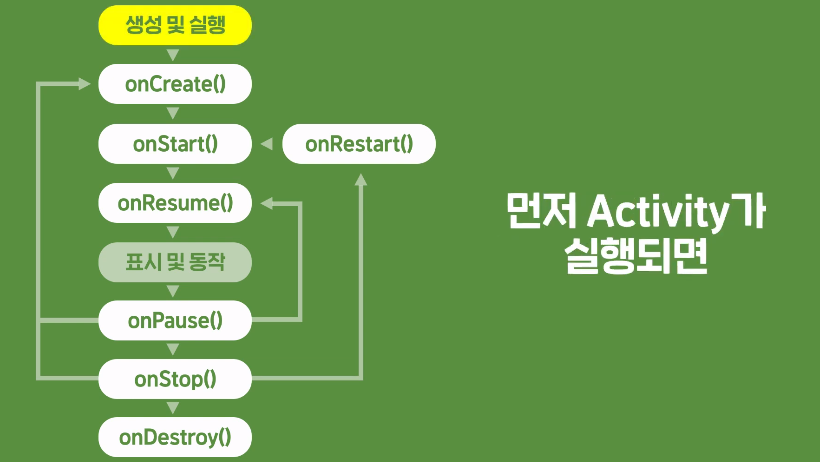

# 안드로이드 

### 0.단축키 및 용어정리

>자바파일안에 있는 내가 만든 프로젝트를 클릭 후 Ctrl + insert를 하게 되면 생성할 수 있는 목록이 나온다. 
>
>패키지를 클릭하고 ctrl + alt + insert 를 누르면 생성가능한 몰록이 나온다. 
>
>Shift+f10 : Run app 
>
>가상 디바이스는 부팅시 시간이 걸리므로 계속 켜두는 것이 좋다. 
>
>Ctrl+Space : 코드를 자동으로 완성시켜줌
>
>Alt+Space: 오류가 뜨는 곳에 마우스 커서를 대고 누르면 오류해결하기 위한 힌트 제공
>
>Alt+Enter: 오류를 자동으로 고쳐주는 기능 주로 import함수를 불러올때 사용된다.
>
>Ctrl+Tab: 스위처기능으로 윈도우의 화면 전환이랑 비슷
>
>#### 디버깅은 빨간점(중단점) 생성 후  디버그 버튼 (Shift+F9) 실행
>
>>F7: 현재 멈춘 라인에 있는 메서드 속으로 들어가는 단축키입니다.
>>
>>F9: 다음 중단점을 만날 때까지 실행합니다.
>>
>>Shift+F8: 현재 메소드를 빠져나갈때까지 실행합니다.
>>
>>F8: 소스 코드를 딱 한 줄만 실행합니다.
>>
>>Alt+F9: 커서가 있는 곳까지 실행합니다.
>
>
>
>#### 용어정리
>
>>안드로이드 SDK: 안드로이드  Software Development Kit 
>>
>>안드로이드 API: 안드로이드 Application Programming Interface

### 1.Gradle

>프로젝트에 포함된 파일과 그에 연관된 모듈들을 링크하여 앱을 컴파일하는 빌드 시스템이다.
>
>프로젝트에 포함된 모듈이 수정되거나 추가될때마다 Gradle에 의한 sync과정이 발생한다
>
>manifests : 앱에 대한 설정파일
>
>java: 사용자가 만든 자바나 코틀린 코드 포함, 안드로이드 스튜디오가 자동생성한 코드가 포함
>
>res: 앱에 사용되는 여러 리소스들을 포함한다. 
>
>Gradle Scripts : 프로젝트를 빌드하기 위해 Gradle에서 사용하는 설정 파일들을 말한다. 

### 2.Activity

>안드로이드 앱의 Ul를 담당하는 제일 큰 단위이다.   
>
>Activity는 안드로이드  API 내에서 클래스로 제공되어 이를 상속받아 앱에서 사용할 Activity를 사용함.
>
>개발자가 직접 만들어 사용하는 것이 아닌 시스템에 의해 생성되어 로드되거나 액티비티를 시작하는 
>
>Start Activity 함수에 의해 '간접적'으로 띄울 수 있다. 
>
>Activity의 시작과 종료를 안드로이드 시스템이 직접 관리하는 하는 과정을 Activity Lifecycle 이라고 한다. 
>
>
>
>
>
>Activity가 실제로 화면에 보이기 전까지 onCreate() , onStart(), onResume() 함수가 실행된다. 
>
>onCreate()는 activity 생성시 단 한번만 호출되기 떄문에 공통적으로 사용되는 변수의 초기화나
>
>화면에 표시되는 UI의 초기값 설정을 한다. 
>
>onStart(), onResume()은 처음 시작할때 뿐만 아니라 Activity가 가려졌다가 다시 돌아올때 실행된다.
>
>>화면의 일부가 가려지는 경우 -> 일시정지가 되어 onPause() 가 되고 
>>
>>다른 Activity로 완전히 전환되는 경우->  onPause()이 먼저 불리고 onStop() 이 된다. 
>
>따라서 onStart(), onResume() 은 다른 화면에서 입력받은 내용을 통해 바뀔 수 있는 데이터를 초기값 설정 또는 갱신을 하는 역할을 한다. 
>
>
>
> onPause(), onStop()의 경우에는 시스템이 메모리나 배터리의 사용량을 줄이기 위해서 Activity를 메모리에서 완전히 제거하기도 합니다. 따라서 다시 Activity를 하게되도 onCreate() 부터 실행하게 된다. 
>
>
>
>개발자가 명시적으로 Activity를 종료하기 위해 Activity.finish()를 사용하거나
>
>시스템에 의해 강제적으로 Activity가 종료되는 경우 onDestroy()를 사용 하게 된다. 

### 3.기본 개념

>launch Activity는 처음 화면으로 뜨는 Activity로 설정하는 기능이다. 
>
>
>
>AppCompatActivity()라는 안드로이드가 제공하는 Activity 클래스를 상속받아 만들어 진것이다. 
>oncreate() 함수 안에는  super.onCreate(savedInstanceState) 슈퍼 클래스의 함수를 재호출 하는 구문과 setContentView(R.layout.activity_main) 레이아웃 xml를 불러 화면에 출력해주는 구문이
>기본적으로 구현되어 있다. 
>
>앱이 동작되는 동안에 바뀌는 속성이나 클릭 등의 이벤트를 처리하는 부분은 코틀린 코드로 작성.
>
>

## 4.view

>Activity에 View를 표시하기 위해서는 oncreate()함수 안에서 setContentView() 함수를 호출하여 
>
>화면에 표시할 리소스 ID나 코드에서 직접 생성한 view()객체를 넘겨 주면 된다.
>
>view를 설정한다고 해서 바로 화면에 표시되는 것은 아니다. 
>
>Activity LifeStyle에 의해 초기화나 복귀가 완전히 끝난 시점이거나 
>
>터치나 키보드 입력 또는 데이터 변경 등으로 인해 view의 내용이 바뀌어야 하는 시점에 
>
>View System에서 View 클래스의 on Draw 함수를 호출하여 화면에 View의 내용을 호출하여
>
>
>
>화면에 View의 내용을 새로 표시해 준다. 
>
>VIew의 용어 중에 각 해당하는 용어를 그림으로 표시한 것이다. 
>
>
>
>View가 속해있는 상위 View를 (parent) 라고 부른다. 
>
>
>
>플러스가 나타내는 것은 상하좌우로 아무런 제약이 없다는 뜻이다.
>
>
>
>End부분이 제약이 걸린 것을 볼 수 있다.
>
>
>
>wrap_content는 내용의 크기에 따라 VIew의 크기가 자동으로 조절되는 속성값이다. 
>
>view클래스를 개발자가 상속받아 원하는 View의 형태를 직접 구현 할수도 있지만 안드로이드에서는
>
>**여러가지의 파생된View를 제공한다.**
>
>>**ImageView** : 이미지 리소스를 화면에 표시하는 view로 ImageButton 등으로 파생됩니다. 
>>
>>>Drawable이라는 리소를 표시할 수 있다.(Drawable: 화면에 그릴 수 있는  모든 종류의 그래픽 리소스 )
>>>
>>>ex) PNG,JPG,GIF,WebP -> BitmapDrawable 로 분류된다. 
>>>
>>>src 속성: 표시할 Drawable을 지정 ImageView.setImageResource(Drawable의 ID)
>>>
>>>scaleType 속성: ImageView의 영역내에서 이미지를 스케일하는 방식을 설정한다.  
>>>
>>>>#### center
>>>>
>>>>
>>>>
>>>>#### centerCrop
>>>>
>>>>이미지의 사진의 중심으로 크기를 늘리고 긴편은 잘라내는 형식
>>>>
>>>>
>>>>
>>>>#### centerInside
>>>>
>>>>이미지의 긴변에 맞춰 사진을 스케일링 하고 나머지는 배경으로 채운듯 
>>>>
>>>>
>>>>
>>>>#### fitCenter
>>>>
>>>>이미지의 비율로 스케일링 하되 긴변을 기준으로 하고 나머지 부분은 배경으로 사용
>>>>
>>>>
>>>>
>>>>
>>>>
>>>>#### fitStart
>>>>
>>>>fitcenter가 유사하지만 스케일링 좌측 상단을 기준으로 한다. 
>>>>
>>>>
>>>>
>>>>#### fitEnd
>>>>
>>>>fitcenter가 유사하지만 스케일링 우측 하단 을 기준으로 한다. 
>>>>
>>>>
>>>>
>>>>#### fitXY
>>>>
>>>>이미지 뷰의 크기에 맞춰 비율에 상관없이 이미지를 스케일링 한다. 
>>>>
>>>>
>>>>
>>>>#### matrix
>>>>
>>>>사용자가 저장한 matrix에 따라 표시
>>>>
>>>>
>>>>
>>>>이미지를 저장할 때는 폴더 이름을 
>>>>
>>>>
>>>>
>>>>drawable-xxhdpi 로 변경한다. 
>>
>>**TextView** : 단순히 Text를 표시하는 기능을 가지고 있지만 굉장히 다양한 view를 파생하고 있다.
>>
>>>**EditText**: 편집이 가능한 텍스트 박스 
>>>
>>>**Button** : 텍스트가 표시되는 버튼 
>>>
>>>>**RadioButton** : 그룹 중 하나만 선택하는 버튼 
>>>>
>>>>**Switch** : 스위치 모양으로 on/off 를 하는 버튼
>>>>
>>>>
>>>>
>>>>
>>>
>>>
>>
>>**viewGroup** : 
>>
>>>**LinearLayout** : 가로 또는 세로로 순서대로 View를 나열
>>>
>>>
>>>
>>>**ConstraintLayout**: 여러가지 방법으로 View를 자유롭게 나열 
>>>
>>>
>>>
>>>
>>>
>>>강력한 이유는 포함된 View간에도 제약조건을 걸 수 있기 때문이다.
>>>
>>>
>>>
>>>
>>>
>>>**ReCyclerLayout** : 데이터를 리스트나 그리드 형태로 표시
>>>
>>>
>>>
>>>>
>>>>
>>>>다양한 포맷의 목록으로 화면에 출력해주는 기능으로 
>>>>
>>>>데이터를 관리하고 목록에 표시하는  adapater , 그리고 개별 아이템의 View를 생성하여 제공하는
>>>>
>>>>ViewHolder로 구성되어 있다. 
>>>>
>>>>
>>>>
>>>>
>>>
>>>
>>>
>>>**Spinner**: 사용자가 데이터 목록 중 하나를 선택하는 View
>>>
>>>
>>>
>>>**ScrollView** : 내부의 vIew를 스크롤 할수 있도록 하는 View
>>>
>>>**TabLayout** : 텝을 이용해 View 간에 전환이 가능하게 하는 View
>>>
>>>
>>
>>#### CheckBox 와 RadioButton 
>>
>>>CheckBox 와 RadioButton 의 차이점은 CheckBox 는 중복투표가 가능하지만
>>>
>>> RadioButton은 한가지 선택만 가능하다. 
>>>
>>>TextView.setTypeface(Typedface,Int) 는 글꼴이나 스타일을 설정하는 함수로
>>>
>>>Typeface :폰트의 형태 , Int는 글꼴의 스타일을 설정
>>>
>>>
>>>
>>>체크박스 변화를 감시하는 함수 onCheckedChanged 에 기본 포맷 형식은 R.id.Viewid로 이루어져 있다.

### 5.layout

>레이아웃 크기의 단위인 DP(density-independent pixels) 의 줄임말로 일반적인 픽셀은 디스플레이의 
>
>물리적인 도트 하나에 픽셀이 하나씩 매칭되는 개념이지만 dp하나는 물리적인 도트보다 더 클수도 ,작을수도 있다.
>
> 이처럼 안드로이드는 어떤 화면에서도 비슷한 크기의 UI를 제공하는 DP라는 단위를 사용하고 있다.
>
>DP는 디스플레이 해상도 160dpi 를 기준으로 1픽셀=1dp 매칭한 크기로 디스플레이의 해상도 높아질수록
>
>DP와 매칭되는 면적이 커지도록 알아서 UI를 스케일링 해주게 됩니다. 
>
>SP(scale-independent pixels) 는 기본적으로는 DP와 같이 밀도에 독립적인 픽셀이지만 글꼴에 적용하기 위한 단위이다.
>
>따라서 텍스트의 접근성이 중요한 앱이라면 글꼴에 Sp를 사용하는 것이 좋다. 

### 6.Spinner

>spinner는 다른 플랫폼에서 ComboBox라고 불린다.
>
>배열이나 리스트 또는 데이터베이스 에서 가져온 데이터 목록을 화면에 보여주고 
>
>사용자의 선택을 받는 ui이다.
>
>목록을 표시하기 위해서 데이터를  직접spinner에 할당하지 않고 데이터를 관리하는 
>
>Spinner Adapter를 사용
>
>Spinner Adaper는 데이터의 전체 목록 중에서 화면에 표시할 목록의 View를 Spinner에 제공해주는 역할을 한다.
>
>Spinner Adaper는 실제 데이터를 제공하는 부분이 직접 구현되어 있지 않다. 따라서 
>
>Spinner Adaper를 상속받아 배열을 화면에 출력하도록 구현할 것이다. 
>
>ArrayAdapter에는 여러가지 생성자가 있는데 그중 배열을 받아 표시하는 생성자는
>
>첫번째 패러미터로는 Context: view에서 시스템의 기능을 호출하기 위한 클래스로 Activity가 이를 상속받아
>
>만들어져 있으니 this 로 넘겨주면 된다.
>
>두번쨰 패러미터로는 Spinner 의 리스트에 각각의 항목을 표시하기 위한 부분 레이아웃을 지정하는 옵션이다.
>
>세번째 패러미터는 배열을 넣어주면 된다. 
>
>AdapterView는 Adapter를 사용하는 모든 VIew가 상속받는 Spinner의 상위 클래스이다. 
>
>자동완성으로 override 를 해보시면 두가지 함수가 있다. 
>
>onItemSelected 는 항목이 선택되었을때 동작하는 함수이다.
>
>onItemSelected 에는 총 4가지 정보가 파라미터로 들어오는데
>
>처음은 스피너 자신, 두번째는 선택된 항목의 뷰 , 세번쨰 선택된 위치, 네번째는 항목의 id이다.
>
>onNothingSelected는 아무 항목도 선택되지 않았을때 동작하는 함수이다.
>
>
>
>표시되는 문자열과 사용하려는 데이터가 다르면 Model Class를 사용한다.
>
>#### Model Class
>
>>연관성이 있는 데이터를 하나의 클래스 객체로 묶어 사용하는 개념으로 
>>
>>연관되는 속성들을 함께받아 인스턴스화 하게 해주는 기능이다.
>>
>>모든 클래스가 내부적으로 상속받는 Any의 최상위 클래스에 .toString() 출력값을 출력하면 된다. 
>>
>
>spinner의 목록을 전부다 바꿀때에는 spinner가 받은 배열을 바꿔주는 것을 못하고 새로운 spinner를
>
>연결해야한다. 혹은 목록을 추가나 삭제같은 경우는 배열을 listOf() 가 아닌 mutableListOf()를 사용하고
>
>List가 바뀌었다고 apapter가 즉시 화면을 바꾸는 것이 아니기 때문에 
>
>adapter.notifyDataSetChanged()를 별도로 호출해야 한다. 

